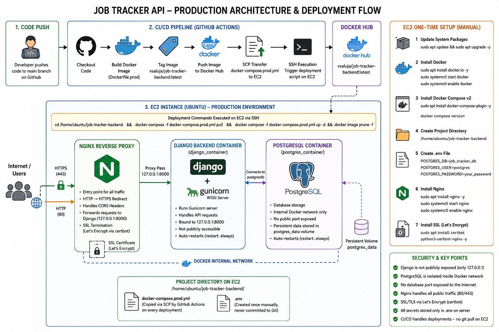

# Job Tracker API — Production Infrastructure & Deployment Engine

This repository hosts the containerized Django backend powering the Job Tracker platform. The application runs inside an isolated production environment on AWS EC2, driven by an automated CI/CD pipeline, an Nginx reverse-proxy network layer, and a Let's Encrypt SSL/TLS secure perimeter.

---

## 🗺️ System Architecture Blueprint

The diagram below highlights the structural communication flow, isolation barriers, security perimeters, and automated release pipeline implemented across this architecture:



---

## ⚙️ Deployment Workflow

### 1. Code Push

- Developer pushes code changes to the `main` branch on GitHub.
- This triggers the GitHub Actions CI/CD pipeline automatically.

---

### 2. CI/CD Pipeline (GitHub Actions)

On every push to `main`, the pipeline performs:

- **Checkout**
  - Pulls the latest repository code into the runner environment.

- **Docker Build**
  - Builds a production-ready image using `Dockerfile.prod`.

- **Docker Tag**
  - Tags the image as:
    ```
    vsaluja/job-tracker-backend:latest
    ```

- **Docker Push**
  - Pushes the image to Docker Hub registry.

- **SCP Transfer**
  - Securely copies the updated `docker-compose.prod.yml` to EC2:
    ```
    /home/ubuntu/job-tracker-backend/
    ```

- **SSH Execution**
  - Connects to the EC2 server and triggers the deployment script.

---

### 3. EC2 Deployment Process

Once the SSH connection is established, EC2 runs:

```bash
cd /home/ubuntu/job-tracker-backend

docker compose -f docker-compose.prod.yml pull
docker compose -f docker-compose.prod.yml up -d

docker image prune -f
```

What happens here:
- Navigates to the deployment folder.
- Pulls the latest Docker image from Docker Hub.
- Restarts all containers with zero downtime.
- Cleans up old unused images to free disk space.

> 💡 There is **no `git clone` or `git pull` on the EC2 server**. The server only needs Docker and the deployment folder. The CI/CD pipeline handles copying the updated compose file via SCP and pulling the latest image from Docker Hub.

---

## 🖥️ EC2 Server Setup — One-Time Manual Setup

This setup is required **only once** when provisioning a fresh EC2 instance. After this, all deployments are fully automated.

### 1. Update System Packages

```bash
sudo apt update && sudo apt upgrade -y
```

### 2. Install Docker

```bash
sudo apt install docker.io -y
sudo systemctl start docker
sudo systemctl enable docker
```

### 3. Install Docker Compose v2

```bash
sudo apt install docker-compose-plugin -y
```

Verify the installation:

```bash
docker compose version
```

### 4. Create Project Directory

```bash
mkdir -p /home/ubuntu/job-tracker-backend
cd /home/ubuntu/job-tracker-backend
```

### 5. Create Environment File

```bash
nano .env
```

Example `.env` contents:

```env
DB_NAME=job_tracker_db
DB_USER=postgres
DB_PASSWORD=your_password
```

> ⚠️ This file is **never committed to Git**. It must be created manually on the server and kept secure. The `POSTGRES_DB`, `POSTGRES_USER`, and `POSTGRES_PASSWORD` values must exactly match the database credentials in Django's `settings.py`.

### 6. Install Nginx

```bash
sudo apt install nginx -y
sudo systemctl start nginx
sudo systemctl enable nginx
```

### 7. Install SSL via Let's Encrypt

```bash
sudo apt install certbot python3-certbot-nginx -y
```

> 👉 After completing these steps, all subsequent deployments are **fully automated** via the CI/CD pipeline.

---

## 🐳 Container Architecture

Services running actively inside the EC2 Docker environment:

### 1. Django Backend Container (`django_container`)
- Runs a high-performance **Gunicorn** server.
- Handles all API requests and business logic.
- Bound strictly to `127.0.0.1:8000` — not publicly accessible.
- Auto-restarts on failure (`restart: always`).

### 2. PostgreSQL Container (`postgres_container`)
- Fully isolated inside the internal Docker network.
- No public ports exposed.
- Uses persistent volume (`postgres_data`) to protect data across container restarts.
- Auto-restarts on failure (`restart: always`).
- Environment variables injected from `.env` must match Django's `settings.py` database config.

---

## 🔁 CI/CD Pipeline Summary

| Step | Action |
|------|--------|
| 1 | Checkout repository |
| 2 | Build Docker image (`Dockerfile.prod`) |
| 3 | Tag image as `latest` |
| 4 | Push image to Docker Hub |
| 5 | SCP `docker-compose.prod.yml` to EC2 |
| 6 | SSH into EC2 |
| 7 | Pull latest image from Docker Hub |
| 8 | Restart containers (`docker compose up -d`) |
| 9 | Cleanup unused images (`docker image prune -f`) |

---

## 🌐 Nginx Reverse Proxy Layer

Nginx acts as the **gateway between the internet and all backend services**.

| Responsibility | Detail |
|---|---|
| **Request Routing** | Forwards all traffic to Django at `localhost:8000` |
| **HTTP → HTTPS** | Automatically redirects all plain HTTP requests to HTTPS |
| **CORS Headers** | Forwards `Origin` header so Django can validate against the allowed list |
| **Security Headers** | Adds host, forwarding, and protocol headers |
| **SSL Termination** | Manages Let's Encrypt certificates via `certbot` |

---

## 🧠 Summary

```
Developer Push (main branch)
          │
          ▼
  GitHub Actions (CI/CD)
  ├── Build Docker Image (Dockerfile.prod)
  ├── Tag → vsaluja/job-tracker-backend:latest
  ├── Push → Docker Hub
  ├── SCP → docker-compose.prod.yml → /home/ubuntu/job-tracker-backend/
  └── SSH → EC2
             │
             ▼
       EC2 Instance
       ├── /home/ubuntu/job-tracker-backend/
       │     ├── docker-compose.prod.yml  (copied via SCP)
       │     └── .env                     (created once manually)
       │
       ├── Nginx (ports 80 / 443) ◄──── Public Internet
       │     └── Proxy → 127.0.0.1:8000
       │
       ├── django_container  (Gunicorn, internal only)
       │     └── depends_on → postgresdb
       │
       └── postgres_container  (internal Docker network only)
                 └── postgres_data  (persistent volume)
```
